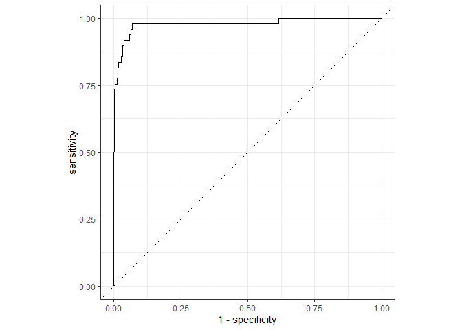
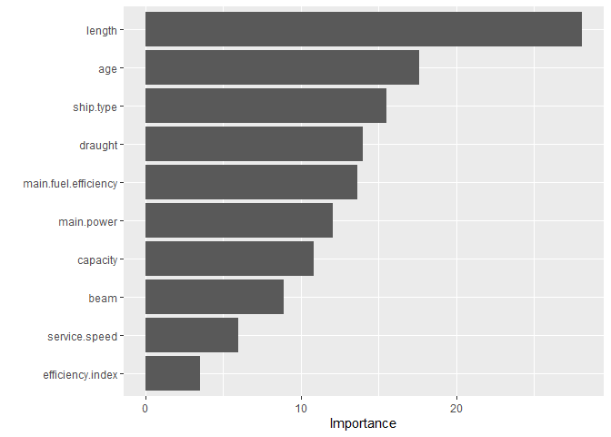

Executive Summary
-----------------

The use of alternative fuels is seen as one of the main levers for
decarbonizing maritime transport and a lot of resources are devoted in
fostering their adoption and development. In this project, I am
interested in predicting if already existing vessels have the option to
use alternative based on their ship specific design parameters. For the
task, the random forests machine learning algorithm is used to classify
if a ship uses alternative fuels or not. To deal with the class
imbalances in the binary outcome variable a down-sampling strategy is
applied and missing values in the predictors are imputed by the
k-Nearest Neighbors algorithm. To find the random forest model with the
best predictive power, I tune the hyperparameters by applying a simple
grid search and evaluate the models’ performance with a 5-fold cross
validation. Since this process requires to train 50 random forests with
a 1000 decision trees each, I parallelize the training process. Lastly,
I evaluate the best performing random forest on the test set, visualize
the results, and assess the importance of the individual predictors. The
final random forest model is able to predict correctly the vessels using
alternative fuels with roughly 90% accuracy and looks promising for the
classifying new unseen data. From a maritime perspective, the identified
high importance of the length (LOA) is a surprising results, which could
motivate a more thorough investigation of the ship designs of vessels
already using alternative fuels.

Data and Initial Observations
-----------------------------

As a first step, let us have a look at the data. Note that the IMO
number is omitted in the output for disclosure reasons.

``` r
glimpse(df[,2:12])
```

    ## Rows: 9,860
    ## Columns: 11
    ## $ efficiency.index     <fct> EIV, EIV, EIV, EIV, EIV, EIV, EIV, EIV, EIV, E...
    ## $ ship.type            <fct> Ro-ro ship, Bulk carrier, Bulk carrier, Genera...
    ## $ age                  <dbl> 48.83000, 12.16667, 26.91667, 21.83333, 25.666...
    ## $ capacity             <int> 2838, 38191, 26264, 7049, 7148, 6232, 7075, 73...
    ## $ service.speed        <dbl> 19.0, 14.0, 14.0, 14.7, 14.7, 16.5, 14.8, 13.0...
    ## $ draught              <dbl> 4.950, 10.920, 9.850, 7.415, 7.415, 7.200, 7.0...
    ## $ beam                 <dbl> 19.21, 27.60, 23.09, 19.40, 19.30, 19.20, 19.3...
    ## $ length               <dbl> 124.20, 193.84, 180.16, 131.40, 131.40, 124.50...
    ## $ main.power           <int> 5884, 10900, 5421, 4690, 4690, 4500, 4965, 375...
    ## $ main.fuel.efficiency <dbl> NA, NA, NA, NA, NA, 171.0, 176.9, NA, 176.9, 1...
    ## $ fuel                 <fct> 2, 2, 2, 2, 2, 2, 2, 2, 2, 2, 2, 2, 2, 2, 2, 2...

We have a variety of ship specific design parameters available to build
our model. For example, there is information about the ship type, the
ship’s age, capacity (in deadweight tonnes), service speed and
dimensions (draught, beam and length) in the data. Further, we know the
power and fuel oil consumption of the main engine and if the vessel
obtained an EEDI rating or reports its EIV index value as a measure of
its energy efficiency. The categorical variable of interest is “fuel”.
The variable has two classes where “1” indicates that the ship has the
option of using alternative fuels and “2” that it (only) has the
capability to use traditional fuels. So we are dealing with a two-class
classification problem and are especially interested in predicting if a
ship uses an alternative fuel based on its other ship characteristics.

``` r
df %>% count(fuel) %>% mutate(prop = n/sum(n))
```

    ##   fuel    n       prop
    ## 1    1  184 0.01866126
    ## 2    2 9676 0.98133874

A first inspection of the fuel variable reveals that the classes are
highly imbalanced in the data set. Only roughly 1.86% of vessels have
the option to use alternative fuels. This is problematic since if we
just would guess that every ship in the data belongs to class 2
(=traditional fuels), we could achieve an accuracy of 98.13%! Hence, if
we do not account for these imbalances, it is likely that we end up with
a model which is very good at predicting the frequent class “2” but
performs poorly in predicting the infrequent class, which we are
actually more interested in. In more technical terms, our model would
probably yield a very good Specificity, but poor Sensitivity due to
infrequent occurrence of alternative fuels. A possible strategy to
address this issue is subsampling the data and there exist various
methods of subsampling. For this project, we go with the simple approach
of down-sampling, which randomly removes observations from the majority
class so that our resulting data is more balanced with respect to the
two fuel classes. Another issue is that we have some missing values in
our predictors.

``` r
df %>% summarise_all(~ sum(is.na(.)))
```

    ##   imo.number efficiency.index ship.type age capacity service.speed draught beam
    ## 1          0                0         0   0        0          1147       0    1
    ##   length main.power main.fuel.efficiency fuel
    ## 1      2        103                 1552    0

The missing values are most prominent in our service speed and main
engine fuel efficiency variables. We will use the K-Nearest Neighbors
algorithm to impute missing values for all the predictors. The algorithm
will identify “K” samples in the data set which are similar to our
observations with missing values (these are the neighbors) and then
estimate the value for the missing data points from these samples. We
will address both of these issues in our data preprocessing step.

Parallel Processing and Splitting the Data
------------------------------------------

Since I am working on my local machine and random forests can be
computationally demanding, it makes sense to set up parallel processing
to speed up the training process.

``` r
library(doParallel)
all_cores <- parallel::detectCores(logical = FALSE)
registerDoParallel(cores = all_cores)
```

Now we can start with splitting the data into a training and testing
data set. The random split is 75/25 between the training and testing set
and stratified for our imbalanced outcome variable to ensure that the
class probabilities stay roughly the same in the two resulting data
sets.

``` r
library(tidymodels)

set.seed(10)
data_split <- initial_split(df, strata = fuel, prob = 0.75)

train_df <- training(data_split)
test_df  <- testing(data_split)

train_df %>% count(fuel) %>% mutate(prop = n/sum(n))
```

    ##   fuel    n       prop
    ## 1    1  135 0.01825558
    ## 2    2 7260 0.98174442

``` r
test_df %>% count(fuel) %>% mutate(prop = n/sum(n))
```

    ##   fuel    n      prop
    ## 1    1   49 0.0198783
    ## 2    2 2416 0.9801217

Resampling for Model Performance Evaluation
-------------------------------------------

To evaluate the performance of the random forest models, I rely on the
resampling technique of 5 fold cross-validation. Intuitively, this works
by randomly splitting the training set into five groups of roughly equal
size. These are the five validation sets, which are used to calculate
performance metrics. For each of these five groups, the four other folds
form the analysis set on which we will fit the models. The overall model
performance is then evaluated by averaging the performance metrics of
the five validation sets. Note thatin general evaluating a model based
on predicting the whole training set likely leads to overoptimistic
performance metrics since the data was already used to fit the machine
learning model.

``` r
set.seed(10)
folds <- vfold_cv(train_df, v = 5)
folds
```

    ## #  5-fold cross-validation 
    ## # A tibble: 5 x 2
    ##   splits              id   
    ##   <list>              <chr>
    ## 1 <split [5.9K/1.5K]> Fold1
    ## 2 <split [5.9K/1.5K]> Fold2
    ## 3 <split [5.9K/1.5K]> Fold3
    ## 4 <split [5.9K/1.5K]> Fold4
    ## 5 <split [5.9K/1.5K]> Fold5

Data Preprocessing
------------------

Note that throughout this project, I heavily rely on the tidymodels
framework in R for the model building and validation process due to its
convenient and holistic approach for building machine learning models.
Before turning to actually building and training the random forest
model, I first prepare the data for fitting these models. Random forests
in general require only little data preprocessing so I do not need to
worry about, for example, normalizing the numerical predictors or
converting the nominal predictors into numeric binary model terms.
Hence, the data preparation will mostly revolve around the
aforementioned observations of imputing missing values with the K-NN
algorithm and down-sampling the outcome variable to correct for the
observed class imbalances. Additionally, I also declare the IMO number
as an identification variable so it is not used for predicting the
outcome when fitting the models and remove (potential) zero-variance
variables, which possess no predictive power.

``` r
rec_bal <- recipe(fuel ~ ., data = train_df) %>%
  update_role(imo.number, new_role = "ID") %>%
  step_knnimpute(all_predictors())  %>%
  step_zv(all_predictors()) %>%
  step_downsample(fuel)
```

It is important to highlight, that these preprocessing steps are NOT
applied to the whole training set. The reason is the use of 5-fold cross
validation for evaluating model performance. If we would apply these
steps to the whole training set we could face a data leakage problem in
our analysis due to the imputation step and could derive poor estimates
of actual model performance due to subsampling the data. To illustrate
the data leakage problem, the K-NN algorithm would have access to data
points which are not present in all of the analysis sets and, thus,
could exploit information from “outside” the analysis set to derive
estimates for the missing values, which might lead to overoptimistic
performance metrics. In general, the preprocessing should be conducted
on each of the five analysis sets individually to avoid these issues.
Hence, for now I just store the outlined steps in a so called recipe for
later usage within the resamples.

Building the Random Forest Model
--------------------------------

Random forest models are popular for classification problems not only
due to their aforementioned low maintenance. Further, they correct for
the overfitting tendency of simple decision tree models and normally
yield good results even with default model hyperparameters.
Nevertheless, we will tune two model hyperparameters to optimize
performance. Let’s start with setting up the random forest for
classification with the “ranger” package.

``` r
rf_mod_tune <-  rand_forest(mtry = tune(), min_n = tune(), trees = 1000) %>% 
  set_engine("ranger", importance = "impurity") %>% 
  set_mode("classification")
```

One can see that, one random forest will consist of 1,000 decision tress
and I will tune the number of predictors which will be randomly sampled
at each split (mtry) and the minimum number of required data points for
a tree node to be split further (min\_n). Afterwards, I combine the
preprocessing and the model in a workflow, which will be used when
fitting the models.

``` r
rf_wf <-  workflow() %>% add_model(rf_mod_tune) %>% add_recipe(rec_bal)
```

Fitting the Models and Hypertuning with Grid Search
---------------------------------------------------

To tune our two hyperparameters of interest a simple space-filling grid
search with 50 (random) parameter sets is generated. Hence, my local
machine needs to train 1,000 decisions trees for each of the 50
potential random forest models. It is possible, to use a more
sophisticated method or a larger scope for the grid search, but for the
project this simple approach shall be sufficient. As already stated,
accuracy in this application is not a suitable metric to assess model
performance due to the class imbalances in our outcome variable.
Therefore, I define a different set of metrics for assessing model
performance

``` r
cls_metrics <- metric_set(specificity, sensitivity, roc_auc, j_index)
```

The ROC-AUC score is a common performance metric when evaluating machine
learning models. Due to the empirical setting with strong class
imbalances in the outcome variable, our main metric used will be the
Youden’s J statistic (J-index). The J-index is defined as J =
sensitivity + specificity - 1 and the closer the value is to 1 the more
observations we correctly label as true positives and true negatives.
Let’s recall our initial reflections about random guessing the outcome
variable and the possibility of picking a model which performs very poor
in predicting the low frequency class of interest when optimizing
overall accuracy. In contrast, the J-index gives equal weights to the
predictions for both classes and, thus, seems to be a good alternative
in this context. We now have finally all the pieces together and start
fitting our 50 potential random forest models with the five analysis
data sets.

``` r
set.seed(10)

rf_tuned = tune_grid(rf_wf, resamples = folds, grid = 50, metrics = cls_metrics,
                     control = control_grid(verbose = T))
```

Afterwards, we can see which candidate model performed best according to
the J-statistic and collect the hyperparameter values from the best
performing model.

``` r
rf_tuned %>% show_best(metric = "j_index",n = 5)
```

    ## # A tibble: 5 x 8
    ##    mtry min_n .metric .estimator  mean     n std_err .config
    ##   <int> <int> <chr>   <chr>      <dbl> <int>   <dbl> <chr>  
    ## 1     5     6 j_index binary     0.900     5  0.0181 Model43
    ## 2     3     7 j_index binary     0.898     5  0.0205 Model33
    ## 3     8     5 j_index binary     0.895     5  0.0200 Model28
    ## 4     2    10 j_index binary     0.893     5  0.0124 Model12
    ## 5     2    11 j_index binary     0.893     5  0.0121 Model48

``` r
rf_best_params <- rf_tuned %>% select_best("j_index")
```

The last step now is update the random forest model with the identified
hyperparameter values and fit the model on last time on the complete
training set and then evaluate the model performance with the unseen
test set.

``` r
rf_model_final <- rf_mod_tune %>% finalize_model(rf_best_params)

rf_wf_final = workflow() %>% add_model(rf_model_final) %>% add_recipe(rec_bal)

rf_fit_final = last_fit(rf_wf_final, data_split, metrics = cls_metrics)
```

Let’s examine the performance metrics of the final model’s test set
predictions more closely. First, we can see that the down-sampling
strategy combined with using the J-index as the main performance metric
appeared to be successful: the sensitivity of roughly 90% indicates that
the model is able to correctly classify the vessels with alternative
fuels (the minority class of interest) in 90% of the cases. Further,
when comparing the J-index from fitting the model on the analysis sets
with the final fit, we can see that the drop in performance is minor.
This is reassuring, since our hypothesis how well the model would
perform on unseen data is not very different from the actual performance
for the test set. Therefore, we can be quite confident that our final
model would also perform decently on other unseen data sets.

``` r
collect_metrics(rf_fit_final)
```

    ## # A tibble: 4 x 3
    ##   .metric .estimator .estimate
    ##   <chr>   <chr>          <dbl>
    ## 1 spec    binary         0.959
    ## 2 sens    binary         0.918
    ## 3 j_index binary         0.877
    ## 4 roc_auc binary         0.980

Exploring the results
---------------------

To conclude the project, I briefly visualize some of the model results.
Firstly, let’s see how much our model is able to separate between the
classes by looking at the area under the receiver operating
characteristics (= the AUC-ROC Curve). From the performance metrics, we
already know that our final model has a ROC-AUC score of close to 1 and,
thus, performs very good in separating the two classes for the test set.
To investigate this observation further, the ROC-AUC curve is plotted
below.

``` r
pred = collect_predictions(rf_fit_final)

rf_fit_final %>% collect_predictions() %>% roc_curve(fuel , .pred_1) %>% autoplot()
```



In this project, we are mainly interested in classifying the ships with
the option of using alternative fuels correctly. The graph depicts on
the y-axis how many of the ships with alternative our algorithm
classified as such (true positives) and on the x-axis how many ships
without alternative fuels were incorrectly classified as vessels with
alternative fuels (false positives) for different threshold values.
Note, that there also is a direct relationship between the J-index and
the ROC curve. In the graph, the J-index is the (vertical) difference
between the dotted line and the ROC-curve. By using the J-index as the
main performance metric, the hyperparameters and threshold value of the
final model were optimized based on the maximum value of this distance.
Lastly, we can also plot the importance of our predictors expressed by
the variable importance score.

``` r
rf_fit_final %>% pluck(".workflow", 1) %>% pull_workflow_fit() %>%  vip(num_features = 10)
```



Interestingly, a vessel’s length appears to be the most important
feature for assessing if a ship has the option of using alternative
fuels or not in this data set. To further explore this observation, we
can have a look at the average length of vessels for both classes.

``` r
df %>% group_by(fuel) %>% summarize(average_length = mean(length, na.rm=T))
```

    ## # A tibble: 2 x 2
    ##   fuel  average_length
    ##   <fct>          <dbl>
    ## 1 1               261.
    ## 2 2               205.

It appears that the vessels using alternative fuels are on average
longer than the vessels without these capabilities. It could be that
length is in our data a proxy for certain ship designs specifically
optimized for energy efficiency and alternative fuel usage.
Investigating the ship design of ships with the option of using
alternative fuels could be another interesting project since it might
yield interesting insights for the maritime industry. The high rank of a
vessel’s age and type are not to surprising from a maritime point of
view. To illustrate, given the recent efforts to adopt alternative fuels
in the maritime industry, one would expect that newer ships have more
frequently the capability of using them. Similarly, alternative fuels
like LNG are especially attractive for certain ship types like LNG
carriers due to their ship design. These observations conclude the
project: we have seen that it is possible to derive a solid prediction
for if a ship uses alternative fuels by using a simple random forests
machine learning algorithm and to get some basic insights which
predictors are the most important for the classification task at hand.
